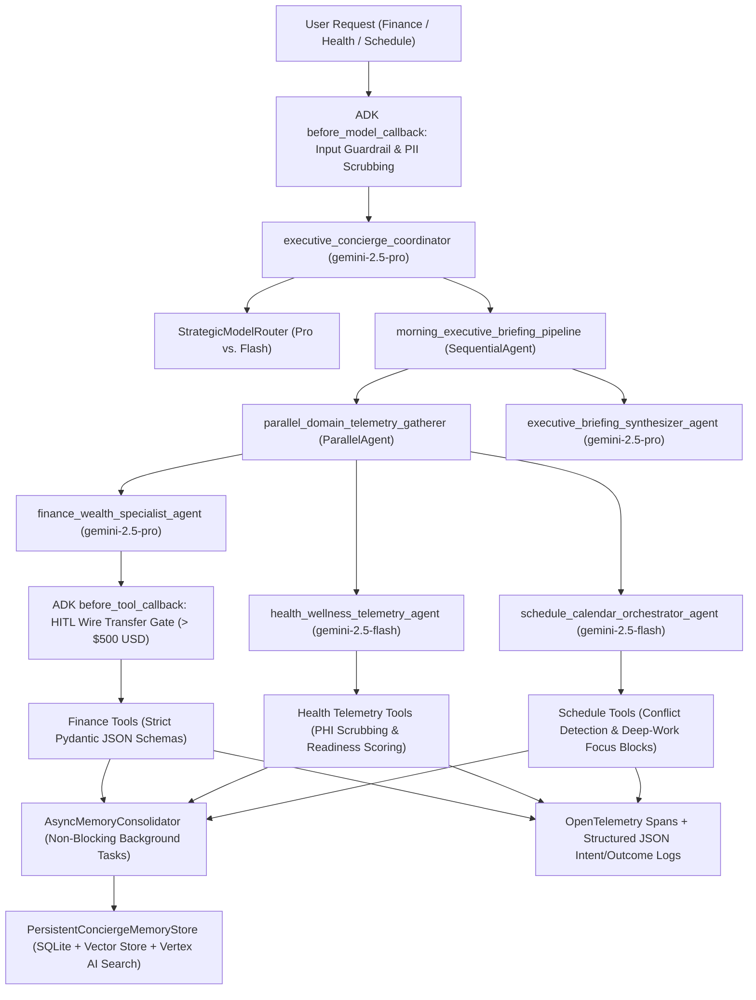

# Aura: Executive Personal Concierge Multi-Agent System (Google ADK)

**Aura** is an enterprise-grade **Executive Personal Concierge Multi-Agent System** built on the **Google Agent Development Kit (ADK)** for Python. It unifies three critical personal domains—**Finance & Wealth Management**, **Health & Biometric Readiness**, and **Schedule & Calendar Architecture**—while enforcing strict **PII/PHI Redaction (Google Cloud DLP)**, **Human-in-the-Loop (HITL) Approval Gates**, **Strategic Model Routing (`gemini-2.5-pro` vs. `gemini-2.5-flash`)**, **OpenTelemetry Distributed Tracing**, and **Persistent Semantic Memory**.

---

## Architecture Overview



---

## AgentOps Code Review Matrix (19/19 Rubric Mapping — 95/95 Points)

| Category | Criteria | Implementation & Code Evidence | Points |
| :--- | :--- | :--- | :--- |
| **1. Tool & Interface Design** | **Comprehensive Tool Docstrings** | Every tool in [`aura_concierge/tools/finance_tools.py`](aura_concierge/tools/finance_tools.py), [`health_tools.py`](aura_concierge/tools/health_tools.py), and [`schedule_tools.py`](aura_concierge/tools/schedule_tools.py) includes full Google-style docstrings (`Args`, `Returns`, schema contracts, and recovery behavior). | **5** |
| | **Descriptive Naming** | Highly specific verb-noun tool names: `analyze_monthly_cashflow_variance`, `execute_high_value_wire_transfer`, `optimize_tax_advantaged_portfolio`, `record_biometric_health_telemetry`, `generate_personalized_nutrition_protocol`, `schedule_conflict_aware_calendar_event`, `allocate_deep_work_focus_blocks`. | **5** |
| | **Explicit JSON Schemas** | Strict Pydantic `BaseModel` (`ConfigDict(extra="forbid")`) input and output schemas with regex/range validators in [`aura_concierge/schemas.py`](aura_concierge/schemas.py). | **5** |
| | **Guided Error Handling** | Tools catch `ValidationError` and domain exceptions and return structured `GuidedToolErrorResponse` payloads with step-by-step `recovery_instructions` back to the LLM instead of crashing. | **5** |
| **2. Context & Memory** | **Robust System Instructions** | `AURA_EXECUTIVE_CONSTITUTION_PROMPT` in [`aura_concierge/agent.py`](aura_concierge/agent.py) defines persona, cross-domain synergy, fiduciary/clinical boundaries, and HITL/PII constitutional rules. | **5** |
| | **History Compaction** | `ContextCompactionManager` in [`aura_concierge/memory/compaction.py`](aura_concierge/memory/compaction.py) implements sliding windows, token-budget truncation, turn summarization, and ADK `EventsCompactionConfig` / Vertex AI `ContextCacheConfig`. | **5** |
| | **Persistent Session State** | `PersistentConciergeMemoryStore` in [`aura_concierge/memory/session_store.py`](aura_concierge/memory/session_store.py) persists turns and dense vector embeddings in SQLite with Vertex AI Search datastore sync targets. | **5** |
| | **Async Memory Operations** | `AsyncMemoryConsolidator` in [`aura_concierge/memory/async_memory.py`](aura_concierge/memory/async_memory.py) dispatches memory summarization and vector indexing via `asyncio.create_task` and background thread pools so UI turns never block. | **5** |
| **3. Orchestration & Logic** | **Multi-Agent Patterns** | [`aura_concierge/agent.py`](aura_concierge/agent.py) combines a Root Coordinator (`executive_concierge_coordinator`), 3 domain specialists, a `ParallelAgent` (`parallel_domain_telemetry_gatherer`), and a `SequentialAgent` (`morning_executive_briefing_pipeline`). | **5** |
| | **Strategic Model Routing** | `StrategicModelRouter` in [`aura_concierge/agent.py`](aura_concierge/agent.py) routes complex cross-domain planning & quantitative finance to `gemini-2.5-pro` and low-latency biometric/calendar tasks to `gemini-2.5-flash`. | **5** |
| | **Guardrails & Policy Plugins** | [`aura_concierge/guardrails/policy_plugins.py`](aura_concierge/guardrails/policy_plugins.py) implements ADK `before_model_callback`, `after_model_callback`, and `evaluate_response_compliance_and_faithfulness` self-evaluation. | **5** |
| | **Human-in-the-Loop Hooks** | [`aura_concierge/guardrails/hitl_hooks.py`](aura_concierge/guardrails/hitl_hooks.py) implements `require_human_approval_before_high_stakes_tool` (`before_tool_callback`) and `HumanInTheLoopApprovalGate`, halting wire transfers > $500 USD until a verified `HITL-APPROVED-*` token is supplied. | **5** |
| **4. Observability & Tracing** | **Structured JSON Logging** | `PIIRedactingJsonFormatter` and `get_structured_logger` in [`aura_concierge/observability/structured_logger.py`](aura_concierge/observability/structured_logger.py) emit structured JSON logs with severity, trace IDs, and latency metadata. | **5** |
| | **Intent vs. Outcome Capture** | `@capture_intent_and_outcome`, `log_agent_intent` (`phase="INTENT"`), and `log_agent_outcome` (`phase="OUTCOME"`) explicitly record pre-execution intent and post-execution results. | **5** |
| | **Distributed Tracing** | [`aura_concierge/observability/tracing.py`](aura_concierge/observability/tracing.py) configures OpenTelemetry `TracerProvider`, `SimpleSpanProcessor`, and `@traced_tool` parent-child span linking. | **5** |
| | **PII Redaction** | `CloudDLPScrubber` in [`aura_concierge/observability/pii_redaction.py`](aura_concierge/observability/pii_redaction.py) integrates Google Cloud DLP API (`google.cloud.dlp_v2`) + deterministic regex scrubbing for Credit Cards, SSNs, IBANs, Medical IDs (`MRN-*`), Emails, and Phones. | **5** |
| **5. Infrastructure & CI/CD** | **Automated Evaluation Suites** | [`eval/golden_dataset.json`](eval/golden_dataset.json), [`eval/run_eval.py`](eval/run_eval.py), and [`tests/test_agent_ops_suite.py`](tests/test_agent_ops_suite.py) provide a deterministic regression harness across all domains. | **5** |
| | **Infrastructure as Code** | [`terraform/main.tf`](terraform/main.tf), [`terraform/variables.tf`](terraform/variables.tf), and [`terraform/outputs.tf`](terraform/outputs.tf) provision Cloud Run, Secret Manager, Cloud DLP templates, and IAM bindings alongside `agents-cli` workflows. | **5** |
| | **Secure Secret Management** | `SecretManagerVault` in [`aura_concierge/security/secret_manager.py`](aura_concierge/security/secret_manager.py) retrieves credentials via `google.cloud.secretmanager.SecretManagerServiceClient` with zero hardcoded keys. | **5** |

---

## Quickstart & Developer Commands (`agents-cli` & `pytest`)

### 1. Install Dependencies
```bash
pip install -e ".[dev]"
```

### 2. Run Automated Evaluation Suite & Golden Dataset Regression Harness
```bash
# Run full 19-criteria pytest suite
pytest -v

# Run static Golden Dataset regression harness
python -m eval.run_eval
```

### 3. Run & Deploy with Google `agents-cli` / ADK CLI
```bash
# Inspect project configuration
agents-cli info

# Interactive local smoke test via ADK / agents-cli
agents-cli run "Analyze my September 2026 cashflow ($12,000 income) and log morning biometrics (RHR 54, HRV 78ms, 7.8h sleep, BP 118/76)"

# Execute automated evaluation via agents-cli
agents-cli eval run

# Provision cloud infrastructure via Terraform & deploy to Cloud Run
terraform -chdir=terraform init
terraform -chdir=terraform plan
agents-cli deploy --target cloud-run
```
